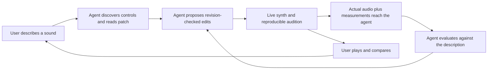

# Agent integration: user story and acceptance

Sarth has the running instrument in front of him, describes a sound to an agent,
and hears and steers the result. Pairing connects that existing agent to this
particular browser tab. The browser remains the authority for patches and DSP.

The local HTTP/WebSocket bridge supplies the control and audio transport in
this diagram. It does not run a model. The connected agent owns reasoning,
listening, iteration budgets, and deciding which candidate to keep. A PCM/WAV
download proves audio delivery, not model listening or improvement. Validation
must distinguish those claims. No claim that an agent heard audio is inferred
from signal measurements or a successful download.

| User-story step | Implementation and proof |
| --- | --- |
| Describe the desired sound | Continue the existing agent conversation; the pairing prompt explains the full loop and its limits. |
| Discover the instrument | Authenticated `describe` returns all 45 controls, units, routing, and operation requirements. |
| Manipulate the visible instrument | `read_patch`, `apply_changes`, and `replace_patch` go through the live tab's `PatchStore`; a browser integration test verifies the actual control values. |
| Generate a sound | `render` uses the same C++/Wasm engine and a recorded note sequence, independently of live voices. |
| Send sound back | An authenticated WAV download accompanies the exact patch, score, revision, sample rate, and measured signal properties. Tests compare the bytes with an independent render. |
| Evaluate and revise | The pairing instructions require actual audio ingestion when supported, transparent disclosure otherwise, fixed-score comparisons, preserved constraints, and retention/restoration of earlier candidates. A successful control test is not a hearing test. |
| User hears and steers | Separately permitted `play` and `stop`, visible agent activity, normal manual controls and Undo. Stale agent proposals cannot overwrite newer user edits. |

## Connection and authorization

- Same-origin local bridge in both `npm run dev` and `npm run preview`; bound
  to loopback, with Host and Origin checks. No cloud relay or synth account.
- Each open tab creates its own session. A one-use, five-minute pairing code
  starts a request. The browser grants an explicit subset of read, edit, render,
  and speaker-playback capabilities for at most 30 minutes.
- Independent host and agent secrets; agent Bearer credentials travel in headers.
  The CLI stores its credential in an ignored file with owner-only permissions.
- Scope and expiration checks apply to every operation and audio download.
  Disconnect revokes credentials, cancels pending work, and drops cached audio.
  A closed/reloaded tab requires fresh pairing; credentials never move to another tab.
- Commands have deadlines and mutation request IDs. Retrying an identical request
  cannot apply an edit or start playback twice; changing its payload is a conflict.
- Bounded requests, sessions, pending operations, retained results, and audio.
  Commands never enter the audio callback or gain filesystem/shell access.

## Delivery checks

1. Pair a CLI agent with a real browser tab; approve in the page.
2. Discover controls, read, rename/edit a batch, and observe the same tab update.
3. Reject missing/expired/revoked/wrong-session credentials and insufficient scopes.
4. Reject stale/invalid patches atomically and replay duplicate requests once.
5. Render a candidate, download and inspect the real WAV, play it with permission,
   render a revision using the same score, and restore the earlier patch.
6. Manual edits remain usable throughout; cancellation, tab closure, revocation,
   and missing audio activation produce explicit outcomes.
7. Run TypeScript, bridge tests, production browser tests, and existing native/Wasm
   checks in CI. Preserve the current Silver flute patch in the user's open tab.

Audio-capable model ingestion and perceptual improvement need direct evidence
from the connected agent. They remain explicit, separately reported validation
items; the bridge must not substitute metadata for listening.
